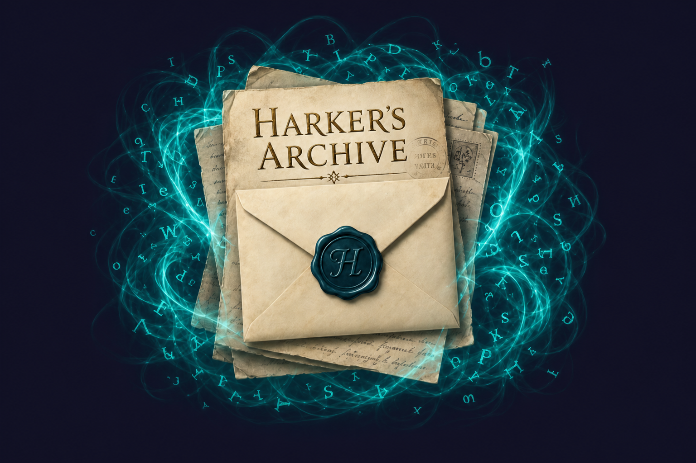
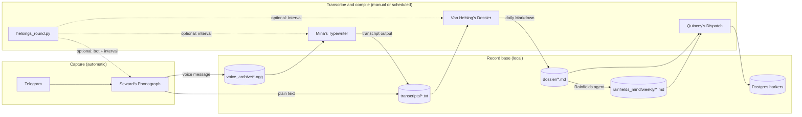

# Harker's Archive



*The mark of the archive: a stack of aged pages and correspondence, with a sea-glass teal aura gathering letters from many directions into one record — Mina's manuscript, in emblem form.*

## The compiled record

Bram Stoker's *Dracula* is not a single diary. It is an **assembled chronicle** — journals, letters, telegrams, newspaper cuttings, and, in Dr. Seward's study at Purfleet, the wax cylinders of a phonograph. Jonathan Harker's Transylvania journal opens the account; Lucy Westenra, Abraham Van Helsing, and others add their witness. Dr. Seward **dictates** his asylum notes into the phonograph so that voice, too, may be preserved.

Mina Murray — later Mina Harker — does not merely listen. She **types**, **orders**, and **compiles** the accounts of many hands into one readable chronology. Seward's cylinders are among her sources, not the only ones. What she produces is a working manuscript: scattered testimony made legible, page by page.

**Harker's Archive** follows that same discipline for a personal record base. Speak or write from wherever you are; let the phonograph preserve the voice; let the typewriter fix it to the page. What accumulates in `transcripts/` is the working manuscript — incomplete, open, and meant to grow.

In modern terms: capture via Telegram, archive locally, transcribe via the OpenAI Audio API when you are ready. The names and flow are metaphor, not historical claim — but the habit of gathering many voices into one record is the point.

## Then and now

| In the novel | In this repository |
|--------------|-------------------|
| Seward dictating into the phonograph | Voice messages → `voice_archive/*.ogg` via [sewards_phonograph](sewards_phonograph/) |
| Mina typing phonograph cylinders | OpenAI transcription → `transcripts/*.txt` via [mina_typewriter](mina_typewriter/) |
| Letters, journals, telegrams | Typed Telegram notes → `transcripts/typed_notes_*.txt` |
| Mina's assembled manuscript | The `transcripts/` folder — the compiled readable record |
| Van Helsing's dossier | Daily Markdown notes in `dossier/` via [van_helsings_dossier](van_helsings_dossier/) |
| Rainfields Mind | Weekly curated synthesis in `rainfields_mind/` — tagged synthesis from the dossier |
| Quincey's Dispatch | Postgres mirror of dossier + weekly notes for other VPS apps via [quinceys_dispatch](quinceys_dispatch/) |

## The circle

| Module | Lore | Role | Docs |
|--------|------|------|------|
| **Harker's Archive** | The compiled stack — many sources, one record | Monorepo root; shared `voice_archive/` and `transcripts/` | — |
| [**Dr. Seward's Phonograph**](sewards_phonograph/) | Seward at the phonograph — voice preserved to cylinder | Telegram bot — saves voice (`.ogg`) and typed text (`.txt`) | [README →](sewards_phonograph/README.md) |
| [**Mina's Typewriter**](mina_typewriter/) | Mina at the keys — whispers fixed to the page | OpenAI Audio API batch transcription — CLI + Streamlit | [README →](mina_typewriter/README.md) |
| [**Van Helsing's Dossier**](van_helsings_dossier/) | Van Helsing at the dossier — testimony ordered into one case file | Compile `transcripts/` into daily Obsidian Markdown | [README →](van_helsings_dossier/README.md) |
| [**Rainfields Mind**](rainfields_mind/) | Curated weekly synthesis | Tagged weekly notes from the dossier | [README →](rainfields_mind/README.md) |
| [**Quincey's Dispatch**](quinceys_dispatch/) | Quincey as courier — the record carried outward | Sync dossier + weekly notes into Postgres for other VPS apps | [README →](quinceys_dispatch/README.md) |

**Root coordinator:** [`helsings_round.py`](helsings_round.py) + [`helsings_roundctl.sh`](helsings_roundctl.sh) — optional; runs the phonograph, schedules the typewriter, compiles/delivers the dossier, refreshes Rainfields Mind weekly notes, and optionally dispatches to Postgres without changing sub-projects.

## How it works



| Step | Tool | When |
|------|------|------|
| Capture voice | Seward's Phonograph | Automatic while the bot runs |
| Capture text | Seward's Phonograph | Automatic while the bot runs |
| Transcribe voice | Mina's Typewriter | Manual — run CLI or Streamlit when ready |
| Compile dossier | Van Helsing's Dossier | Manual — run CLI when ready; or automatic via `helsings_round.py` |
| Rainfields Mind | `rainfields_mind/` | Agent or manual — see [Rainfields Mind](#rainfields-mind) |
| Postgres mirror | Quincey's Dispatch | Manual CLI, or `helsings_round.py` when `QUINCEYS_DISPATCH_ENABLED=true` |
| Run everything | `helsings_round.py` | Bot always on + transcribe when pending + daily backstop pass (see `TRANSCRIBE_PENDING_POLL_SECONDS`, `TRANSCRIBE_INTERVAL_MINUTES`, `DOSSIER_INTERVAL_MINUTES`) |

Typed notes land in `transcripts/` immediately. Voice files wait in `voice_archive/` until you run Mina's Typewriter (or `helsings_round.py` on its schedule).

## Record base layout

```text
harkers_archive/
├── voice_archive/       # raw audio (.ogg from Telegram) — gitignored
├── transcripts/         # typed notes + transcription .txt output — gitignored
├── dossier/             # compiled daily Markdown notes — gitignored
├── rainfields_mind/     # weekly curated synthesis (Rainfields Mind) — tracked in git
│   ├── README.md
│   ├── TAGGING_SYSTEM.md
│   ├── WEEKLY_JOURNAL_INSTRUCTIONS.md
│   ├── index.md
│   └── weekly/          # one file per ISO week, e.g. 2026-W22.md
├── quinceys_dispatch/   # Postgres mirror of dossier + weekly notes for other apps
├── sewards_phonograph/  # Telegram capture bot
├── mina_typewriter/     # OpenAI Audio API transcription
├── van_helsings_dossier/ # transcript compiler → daily Markdown
├── helsings_round.py       # optional: bot + scheduled transcribe coordinator
├── helsings_roundctl.sh    # start / stop / restart / status / logs / logs-http
├── Dockerfile              # container image for helsings_round.py
├── docker-compose.yml      # VPS / Docker: helsings_round + bind-mounted archive folders
├── archive_logging.py      # splits Telegram HTTP traffic into a separate log file
├── .env                 # shared config (gitignored; copy from .env.example)
└── uv.lock              # shared workspace lockfile
```

**Filename conventions**

| Source | Pattern | Example |
|--------|---------|---------|
| Voice message | `{YYYYMMDD}_{HHMMSS}_{user_id}.ogg` | `20260524_151230_123456789.ogg` |
| Typed note (daily file) | `typed_notes_{YYYYMMDD}_{user_id}.txt` | `typed_notes_20260524_123456789.txt` |
| Voice transcript | `{basename}.txt` + `{basename}_segments.txt` | `20260524_151230_123456789.txt` |
| Dossier (daily journal) | `{YYYY-MM-DD}.md` | `2026-06-02.md` |
| Rainfields Mind weekly note | `weekly/{YYYY-WNN}.md` | `weekly/2026-W22.md` |

Each typed note is appended with a timestamp: `[20260524_151230] Your message here.`

## Rainfields Mind

The `rainfields_mind/` folder is a **curated synthesis layer** on top of the generated daily dossier. It does not replace capture, transcription, or `van_helsings_dossier` — and nothing in the current Python pipeline writes to it yet.

| Path | Role |
|------|------|
| [rainfields_mind/README.md](rainfields_mind/README.md) | Overview and folder layout |
| [rainfields_mind/TAGGING_SYSTEM.md](rainfields_mind/TAGGING_SYSTEM.md) | Controlled tags, transcription normalization, when to add new tags |
| [rainfields_mind/WEEKLY_JOURNAL_INSTRUCTIONS.md](rainfields_mind/WEEKLY_JOURNAL_INSTRUCTIONS.md) | Model-agnostic workflow (any LLM can follow this file) |
| [rainfields_mind/index.md](rainfields_mind/index.md) | Index of completed weeks |
| [rainfields_mind/weekly/YYYY-WNN.md](rainfields_mind/weekly/) | One weekly final note per ISO week (Mon–Sun, `America/Fortaleza`) |

**Do not hand-edit `dossier/*.md`** — the compiler overwrites them. Weekly notes live only under `rainfields_mind/weekly/`.

### Weekly ritual (manual, today)

Run this once per week (typically Sunday evening or Monday morning, after the ISO week has ended):

1. **Ensure dossiers are current** — same as step 6 in the tutorial:
   ```bash
   cd van_helsings_dossier && uv run python compile.py
   ```
2. **Pick the ISO week** that just ended (e.g. `2026-W26` = Mon 2026-06-23 … Sun 2026-06-29).
3. **List dossier files** for that week (only files that exist):
   ```bash
   # Replace dates with your week's Mon..Sun
   for d in 2026-06-22 2026-06-23 2026-06-24 2026-06-25 2026-06-26 2026-06-27 2026-06-28; do
     [ -f "dossier/${d}.md" ] && echo "dossier/${d}.md"
   done
   ```
4. **Send one prompt** to your LLM with exactly these attachments:
   - `@rainfields_mind/WEEKLY_JOURNAL_INSTRUCTIONS.md`
   - `@rainfields_mind/TAGGING_SYSTEM.md`
   - `@rainfields_mind/weekly/YYYY-W(N-1).md` — last week's note (skip if none)
   - `@dossier/YYYY-MM-DD.md` — **every dossier file** from step 3
5. **Use the prompt template** in [rainfields_mind/WEEKLY_JOURNAL_INSTRUCTIONS.md § What to put in your prompt each week](rainfields_mind/WEEKLY_JOURNAL_INSTRUCTIONS.md#what-to-put-in-your-prompt-each-week) (fill in week id, date range, and dossier list).
6. **Save** the model output to `rainfields_mind/weekly/YYYY-WNN.md`.
7. **Update** [rainfields_mind/index.md](rainfields_mind/index.md) with the one-line summary the model gives you.
8. **Optional** — if you promoted new tags, append them to [rainfields_mind/TAGGING_SYSTEM.md](rainfields_mind/TAGGING_SYSTEM.md).

Full checklist, copy-paste prompt, and worked example: [rainfields_mind/WEEKLY_JOURNAL_INSTRUCTIONS.md](rainfields_mind/WEEKLY_JOURNAL_INSTRUCTIONS.md#what-to-put-in-your-prompt-each-week).

Weekly notes are primarily in **Portuguese**; keep **English** for reading logs, Cambly notes, and book quotes when the original wording matters.

### Automated agent

[`compile_week.py`](rainfields_mind/agent/compile_week.py) synthesizes weekly notes via the LangGraph + OpenAI pipeline in [`rainfields_mind/agent/`](rainfields_mind/agent/). It loads [WEEKLY_JOURNAL_INSTRUCTIONS.md](rainfields_mind/WEEKLY_JOURNAL_INSTRUCTIONS.md) and [TAGGING_SYSTEM.md](rainfields_mind/TAGGING_SYSTEM.md) at runtime, updates only dirty weeks, and writes reasoning logs to `rainfields_mind/agent/runs/`.

```bash
cd rainfields_mind/agent && uv run python compile_week.py
```

See [rainfields_mind/README.md](rainfields_mind/README.md) for CLI flags, env vars, and cron setup. When using `helsings_round.py`, weekly notes refresh automatically after each transcription pass (after dossier compile when enabled). Set `RAINFIELDS_ENABLED=false` to disable.

| | |
|--|--|
| **Trigger** | Daily cron, or on demand (`--week 2026-W26`) |
| **Read** | `dossier/YYYY-MM-DD.md`; `rainfields_mind/weekly/YYYY-W(N-1).md`; instruction markdown |
| **Write** | `rainfields_mind/weekly/YYYY-WNN.md`; `rainfields_mind/index.md`; candidate tags in `TAGGING_SYSTEM.md` |
| **Do not modify** | `dossier/`, `transcripts/`, `voice_archive/`, existing sub-projects |
| **Week boundaries** | ISO week, Monday–Sunday, timezone `America/Fortaleza` |
| **Provenance** | Preserve `entry_id` from dossier entries in the `Índice de fontes` table |

## Prerequisites

| Requirement | Used by |
|-------------|---------|
| **Python 3.13+** | All modules |
| **[uv](https://docs.astral.sh/uv/)** | Dependency management |
| **Telegram bot token** ([@BotFather](https://t.me/BotFather)) | Seward's Phonograph |
| **OpenAI API key** | Mina's Typewriter and Rainfields Mind agent |
| **Docker + Compose** (optional) | Run on a VPS — see [Docker (VPS)](#9-docker-vps) |

## Tutorial

End-to-end workflow from zero to archived notes.

### 1. Install dependencies

From the repo root:

```bash
uv sync --all-packages
```

### 2. Create a Telegram bot

1. Open [@BotFather](https://t.me/BotFather) in Telegram.
2. Send `/newbot`, follow the prompts, and copy the bot token.

### 3. Configure environment

```bash
cp .env.example .env
```

Edit `.env` at the **repo root** with **absolute** paths:

```bash
TELEGRAM_BOT_TOKEN=your-token-from-botfather
OPENAI_API_KEY=your-openai-api-key
SAVE_DIR=/absolute/path/to/harkers_archive/voice_archive
# Optional; defaults to sibling transcripts/ next to SAVE_DIR
# TRANSCRIPTS_DIR=/absolute/path/to/harkers_archive/transcripts
```

Both sub-projects load this file automatically. See [Configuration](#configuration) for all variables.

### 4. Capture notes (Seward's Phonograph)

As in the novel, the phonograph runs first — preserving voice and text as they arrive:

```bash
cd sewards_phonograph
uv run python bot.py
```

Keep the process running. In Telegram, open **your** bot and:

- Send a **voice message** → saved to `voice_archive/`
- Send **plain text** → appended to `transcripts/typed_notes_YYYYMMDD_<user_id>.txt`

The bot replies with the saved filename. Use `/start` or `/help` for a reminder.

To run in the background: `nohup uv run python bot.py >> bot.log 2>&1 &` — see [sewards_phonograph/README.md](sewards_phonograph/README.md) for details.

### 5. Transcribe voice (Mina's Typewriter)

Transcription is **manual** — run when you are ready, as Mina would sit to the keys:

```bash
cd mina_typewriter
uv run python transcribe.py
```

The CLI reads `voice_archive/` and writes to `transcripts/` by default. Override with `HARKERS_INPUT_DIR` and `HARKERS_OUTPUT_DIR` in the root `.env` if needed.

Or use the Streamlit app to pick custom folders:

```bash
uv run streamlit run app.py
```

Each voice file produces `<basename>.txt` and `<basename>_segments.txt`. Transcription uses the OpenAI Audio API — see [mina_typewriter/README.md](mina_typewriter/README.md) for model options and configuration.

### 6. Compile journal (Van Helsing's Dossier)

Compile scattered transcripts into Obsidian-friendly daily Markdown notes:

```bash
cd van_helsings_dossier
uv run python compile.py
```

Output lands in `dossier/` (one file per day, e.g. `2026-06-02.md`). Re-run after new transcripts arrive — only changed days are rebuilt. See [van_helsings_dossier/README.md](van_helsings_dossier/README.md) for format details.

### 7. Rainfields Mind

After dossiers exist for a full ISO week, synthesize the weekly note — see [Rainfields Mind](#rainfields-mind). Run `compile_week.py` manually, or let `helsings_round.py` refresh dirty weeks after each transcription pass.

### 8. Run everything (`helsings_round.py`)

To keep the phonograph running and transcribe on a schedule (default once a day), from the **repo root**:

```bash
./helsings_roundctl.sh start    # background + log file
./helsings_roundctl.sh status
./helsings_roundctl.sh restart
./helsings_roundctl.sh stop
./helsings_roundctl.sh logs       # tail -f helsings_round.log
./helsings_roundctl.sh logs-http  # tail -f helsings_round_http.log (Telegram polling)
```

Foreground (same terminal):

```bash
uv run python helsings_round.py
```

When `helsings_round.py` is running, new voice files in `voice_archive/` are transcribed within about `TRANSCRIBE_PENDING_POLL_SECONDS` (default **60** seconds). A full coordinator pass still runs on the `TRANSCRIBE_INTERVAL_MINUTES` backstop (default **1440**) even when nothing is pending — for dossier compile and weekly note delivery. After each new transcription, the matching `transcripts/*.txt` is sent to that voice note's Telegram user as a document. If that delivery fails, they get a short failure notice instead; the runner keeps going and does not stop the capture bot.

Van Helsing's Dossier runs on the same coordinator: it compiles `transcripts/` into daily Markdown when new voice transcripts appear, or at least every 24 hours (see `DOSSIER_INTERVAL_MINUTES`). Set `DOSSIER_ENABLED=false` to disable dossier compile while keeping capture and transcription.

Rainfields Mind runs after each transcription pass (and after dossier compile when enabled): it checks for dirty ISO weeks and calls the LLM only when dossiers changed or a weekly note is missing. On the same 24-hour schedule (`DOSSIER_INTERVAL_MINUTES`), archive users receive the most recent weekly note (`.md`) from `rainfields_mind/weekly/` as a Telegram document. Set `RAINFIELDS_ENABLED=false` to skip weekly synthesis while keeping capture and transcription.

Quincey's Dispatch runs after Rainfields when `QUINCEYS_DISPATCH_ENABLED=true`: it upserts dossier days, weekly notes, and manifest entries into Postgres database `harkers`. Failures are logged and do not stop the bot. Requires `HARKERS_DATABASE_URL`.

On every start or restart, archive users receive a short Telegram message confirming the runner is active (disable with `STARTUP_NOTIFY_ENABLED=false`).

This script only calls the existing sub-projects via subprocess — it does not replace manual steps 4–6. Only one instance should run at a time.

Background runs write two log files at the repo root (both gitignored): `helsings_round.log` for coordinator and bot activity, and `helsings_round_http.log` for frequent Telegram HTTP polling (`httpx`). Use `logs` and `logs-http` with the ctl script to tail each file.

### 9. Docker (VPS)

Run [`helsings_round.py`](helsings_round.py) in a container on a VPS. Archive data lives in **host folders** next to the repo (bind mounts) — you can `ssh` in and read `voice_archive/`, `transcripts/`, etc. directly.

**Setup** (once on the VPS):

```bash
git clone https://github.com/GuilherLRO/harkers_archive.git
cd harkers_archive
cp .env.example .env
# Edit .env — TELEGRAM_BOT_TOKEN, OPENAI_API_KEY (required for transcription and Rainfields)
mkdir -p voice_archive transcripts dossier logs rainfields_mind/weekly
docker compose up -d --build
```

**Commands:**

```bash
docker compose logs -f
docker compose restart
docker compose stop
docker compose down              # keeps host folders
```

**Host folders** (same paths inside the container at `/app/…`):

| Host path | Purpose |
|-----------|---------|
| `voice_archive/` | Raw voice files from Telegram |
| `transcripts/` | Typed notes + transcription output |
| `dossier/` | Compiled daily Markdown |
| `rainfields_mind/` | Weekly synthesis + agent inputs |
| `logs/` | Telegram HTTP log (`helsings_round_http.log`) |

Coordinator activity goes to `docker compose logs`. Transcription calls the OpenAI API — ensure `OPENAI_API_KEY` is set in `.env` and the container can reach the network.

**Notes**

- Stop any other bot using the same Telegram token (Mac `helsings_roundctl`, etc.) before starting on the VPS.
- Secrets stay in gitignored `.env` only — not in the image or compose file.
- No inbound ports are exposed; the bot polls Telegram outbound.
- After `uv.lock` changes: `git pull && docker compose up -d --build`.

Path overrides (`SAVE_DIR=/app/…`) are set in `docker-compose.yml` so your host `.env` can keep macOS paths for native runs.

First transcription requires a valid `OPENAI_API_KEY` and network access — see [mina_typewriter/README.md](mina_typewriter/README.md) for model options and limits.

## Testing

Use [TEST_PLAN.md](TEST_PLAN.md) as the full module and end-to-end checklist. The fast local checks are:

```bash
uv sync --all-packages
uv run python -m py_compile helsings_round.py archive_logging.py
cd rainfields_mind/agent && uv run pytest
```

## Configuration

All settings live in the root `.env`. Sub-projects resolve it automatically.

| Variable | Module | Required | Description |
|----------|--------|----------|-------------|
| `TELEGRAM_BOT_TOKEN` | Phonograph | Yes | Bot token from BotFather |
| `SAVE_DIR` | Phonograph | Yes | Absolute path for voice `.ogg` files (e.g. `…/voice_archive`) |
| `TRANSCRIPTS_DIR` | Phonograph | No | Absolute path for typed notes; defaults to sibling `transcripts/` next to `SAVE_DIR` |
| `OPENAI_API_KEY` | Typewriter, Rainfields | Yes (Typewriter) | OpenAI API key for transcription and weekly synthesis |
| `MINA_TRANSCRIBE_MODEL` | Typewriter | No | OpenAI transcription model (default `whisper-1`) |
| `OPENAI_API_BASE` | Typewriter, Rainfields | No | Optional API base URL (official OpenAI endpoint recommended for audio) |
| `HARKERS_INPUT_DIR` | Typewriter | No | Override input folder; defaults to `voice_archive/` |
| `HARKERS_OUTPUT_DIR` | Typewriter | No | Override output folder; defaults to `transcripts/` |
| `HARKERS_TRANSCRIPTS_DIR` | Dossier | No | Override transcript input; defaults to `transcripts/` |
| `HARKERS_DOSSIER_DIR` | Dossier | No | Override dossier output; defaults to `dossier/` |
| `TRANSCRIBE_PENDING_POLL_SECONDS` | `helsings_round.py` | No | Seconds between checks when untranscribed voice files exist (default `60`) |
| `TRANSCRIBE_INTERVAL_MINUTES` | `helsings_round.py` | No | Minutes between full coordinator backstop passes when idle (default `1440`) |
| `DOSSIER_INTERVAL_MINUTES` | `helsings_round.py` | No | Minutes between dossier compile and weekly note delivery cycles (default `1440`) |
| `DOSSIER_ENABLED` | `helsings_round.py` | No | Enable dossier compile (default `true`) |
| `RAINFIELDS_ENABLED` | `helsings_round.py` | No | Refresh Rainfields Mind weekly notes after each transcription pass (default `true`) |
| `QUINCEYS_DISPATCH_ENABLED` | `helsings_round.py` | No | Sync dossier + weekly notes to Postgres after each pass (default `false`) |
| `HARKERS_DATABASE_URL` | Quincey's Dispatch | Yes (when enabled) | Postgres URL for database `harkers` |
| `STARTUP_NOTIFY_ENABLED` | `helsings_round.py` | No | Telegram message to archive users when the runner starts (default `true`) |
| `HELSINGS_HTTP_LOG` | `archive_logging.py` | No | Absolute path for Telegram HTTP log; defaults to `helsings_round_http.log` in the repo root |

## Going deeper

Each module has its own README with artwork, troubleshooting, and reference docs:

- **[Dr. Seward's Phonograph](sewards_phonograph/README.md)** — commands, filename rules, background running, manual test plan
- **[Mina's Typewriter](mina_typewriter/README.md)** — OpenAI models, transcription options, Streamlit UI, API limits
- **[Van Helsing's Dossier](van_helsings_dossier/README.md)** — compile transcripts into Obsidian daily Markdown notes
- **[Rainfields Mind](rainfields_mind/README.md)** — weekly synthesis from dossiers; tagging and LLM instructions
- **[Quincey's Dispatch](quinceys_dispatch/README.md)** — Postgres mirror of dossier + weekly notes for other VPS apps

## The work continues

This archive is deliberately incomplete — a working manuscript, not a closed book. Others are welcome to extend it.

**Pull requests and issues are welcome.** Open a GitHub issue to propose a module name and scope before building, if you like. Follow the conventions in each module's README.

### Roadmap (not yet built)

| Direction | Idea |
|-----------|------|
| Index / search across transcripts | Find passages across the compiled record | **Partial** — [`quinceys_dispatch`](quinceys_dispatch/) mirrors dossier entries + documents to Postgres for SQL consumers |
| Automatic transcription on capture | Phonograph → typewriter without a manual step | **Partial** — [`helsings_round.py`](helsings_round.py) on a schedule |
| Transcript delivery | New `transcripts/*.txt` → Telegram document | **Partial** — [`helsings_round.py`](helsings_round.py) after each transcription |
| Daily dossier compile | Transcripts → Obsidian Markdown | **Partial** — [`helsings_round.py`](helsings_round.py) on a schedule |
| Weekly note delivery | Rainfields Mind → Telegram document | **Partial** — [`helsings_round.py`](helsings_round.py) on a schedule |
| Rainfields Mind | Dossier → tagged weekly synthesis in `rainfields_mind/weekly/` | **Partial** — [`agent/compile_week.py`](rainfields_mind/agent/compile_week.py); automatic via `helsings_round.py` after each transcription pass |
| Summaries or cross-references | Collate related entries across days and sources |
| Further witnesses | New capture or processing modules under the same record base |

### Adding a module

Add a new top-level folder with its own `pyproject.toml`, then register it under `[tool.uv.workspace] members` in the root [pyproject.toml](pyproject.toml). Shared data stays in `voice_archive/`, `transcripts/`, and `dossier/`. The Rainfields Mind synthesis layer lives in `rainfields_mind/` and is safe to extend without touching the capture pipeline.

## License

This project is licensed under the [MIT License](LICENSE).
