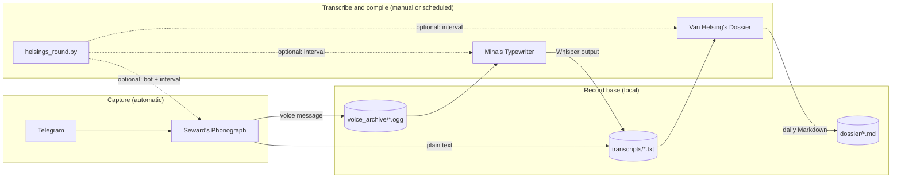

# Harker's Archive


*The mark of the archive: a stack of aged pages and correspondence, with a sea-glass teal aura gathering letters from many directions into one record — Mina's manuscript, in emblem form.*

## The compiled record

Bram Stoker's *Dracula* is not a single diary. It is an **assembled chronicle** — journals, letters, telegrams, newspaper cuttings, and, in Dr. Seward's study at Purfleet, the wax cylinders of a phonograph. Jonathan Harker's Transylvania journal opens the account; Lucy Westenra, Abraham Van Helsing, and others add their witness. Dr. Seward **dictates** his asylum notes into the phonograph so that voice, too, may be preserved.

Mina Murray — later Mina Harker — does not merely listen. She **types**, **orders**, and **compiles** the accounts of many hands into one readable chronology. Seward's cylinders are among her sources, not the only ones. What she produces is a working manuscript: scattered testimony made legible, page by page.

**Harker's Archive** follows that same discipline for a personal record base. Speak or write from wherever you are; let the phonograph preserve the voice; let the typewriter fix it to the page. What accumulates in `transcripts/` is the working manuscript — incomplete, open, and meant to grow.

In modern terms: capture via Telegram, archive locally, transcribe with Whisper when you are ready. The names and flow are metaphor, not historical claim — but the habit of gathering many voices into one record is the point.

## Then and now

| In the novel | In this repository |
|--------------|-------------------|
| Seward dictating into the phonograph | Voice messages → `voice_archive/*.ogg` via [sewards_phonograph](sewards_phonograph/) |
| Mina typing phonograph cylinders | Whisper transcription → `transcripts/*.txt` via [mina_typewriter](mina_typewriter/) |
| Letters, journals, telegrams | Typed Telegram notes → `transcripts/typed_notes_*.txt` |
| Mina's assembled manuscript | The `transcripts/` folder — the compiled readable record |
| Van Helsing's dossier | Daily Markdown notes in `dossier/` via [van_helsings_dossier](van_helsings_dossier/) |

## The circle

| Module | Lore | Role | Docs |
|--------|------|------|------|
| **Harker's Archive** | The compiled stack — many sources, one record | Monorepo root; shared `voice_archive/` and `transcripts/` | — |
| [**Dr. Seward's Phonograph**](sewards_phonograph/) | Seward at the phonograph — voice preserved to cylinder | Telegram bot — saves voice (`.ogg`) and typed text (`.txt`) | [README →](sewards_phonograph/README.md) |
| [**Mina's Typewriter**](mina_typewriter/) | Mina at the keys — whispers fixed to the page | Whisper batch transcription — CLI + Streamlit | [README →](mina_typewriter/README.md) |
| [**Van Helsing's Dossier**](van_helsings_dossier/) | Van Helsing at the dossier — testimony ordered into one case file | Compile `transcripts/` into daily Obsidian Markdown | [README →](van_helsings_dossier/README.md) |

**Root coordinator:** [`helsings_round.py`](helsings_round.py) + [`helsings_roundctl.sh`](helsings_roundctl.sh) — optional; runs the phonograph, schedules the typewriter, and compiles/delivers the dossier without changing sub-projects.

## How it works



| Step | Tool | When |
|------|------|------|
| Capture voice | Seward's Phonograph | Automatic while the bot runs |
| Capture text | Seward's Phonograph | Automatic while the bot runs |
| Transcribe voice | Mina's Typewriter | Manual — run CLI or Streamlit when ready |
| Compile journal | Van Helsing's Dossier | Manual — run CLI when ready; or automatic via `helsings_round.py` |
| Run everything | `helsings_round.py` | Bot always on + transcribe every N minutes + dossier compile/delivery (see `TRANSCRIBE_INTERVAL_MINUTES`, `DOSSIER_INTERVAL_MINUTES`) |

Typed notes land in `transcripts/` immediately. Voice files wait in `voice_archive/` until you run Mina's Typewriter (or `helsings_round.py` on its schedule).

## Record base layout

```text
harkers_archive/
├── voice_archive/       # raw audio (.ogg from Telegram) — gitignored
├── transcripts/         # typed notes + Whisper .txt output — gitignored
├── dossier/             # compiled daily Markdown notes — gitignored
├── sewards_phonograph/  # Telegram capture bot
├── mina_typewriter/     # Whisper transcription
├── van_helsings_dossier/ # transcript compiler → daily Markdown
├── helsings_round.py       # optional: bot + scheduled transcribe coordinator
├── helsings_roundctl.sh    # start / stop / restart / status / logs / logs-http
├── archive_logging.py      # splits Telegram HTTP traffic into a separate log file
├── .env                 # shared config (gitignored; copy from .env.example)
└── uv.lock              # shared workspace lockfile
```

**Filename conventions**

| Source | Pattern | Example |
|--------|---------|---------|
| Voice message | `{YYYYMMDD}_{HHMMSS}_{user_id}.ogg` | `20260524_151230_123456789.ogg` |
| Typed note (daily file) | `typed_notes_{YYYYMMDD}_{user_id}.txt` | `typed_notes_20260524_123456789.txt` |
| Whisper transcript | `{basename}.txt` + `{basename}_segments.txt` | `20260524_151230_123456789.txt` |
| Dossier (daily journal) | `{YYYY-MM-DD}.md` | `2026-06-02.md` |

Each typed note is appended with a timestamp: `[20260524_151230] Your message here.`

## Prerequisites

| Requirement | Used by |
|-------------|---------|
| **Python 3.13+** | All modules |
| **[uv](https://docs.astral.sh/uv/)** | Dependency management |
| **ffmpeg** (`brew install ffmpeg`) | Mina's Typewriter |
| **Telegram bot token** ([@BotFather](https://t.me/BotFather)) | Seward's Phonograph |

## Tutorial

End-to-end workflow from zero to archived notes.

### 1. Install dependencies

From the repo root:

```bash
uv sync --all-packages
```

### 2. Create a Telegram bot

1. Open [@BotFather](https://t.me/BotFather) in Telegram.
2. Send `/newbot`, follow the prompts, and copy the bot token.

### 3. Configure environment

```bash
cp .env.example .env
```

Edit `.env` at the **repo root** with **absolute** paths:

```bash
TELEGRAM_BOT_TOKEN=your-token-from-botfather
SAVE_DIR=/absolute/path/to/harkers_archive/voice_archive
# Optional; defaults to sibling transcripts/ next to SAVE_DIR
# TRANSCRIPTS_DIR=/absolute/path/to/harkers_archive/transcripts
```

Both sub-projects load this file automatically. See [Configuration](#configuration) for all variables.

### 4. Capture notes (Seward's Phonograph)

As in the novel, the phonograph runs first — preserving voice and text as they arrive:

```bash
cd sewards_phonograph
uv run python bot.py
```

Keep the process running. In Telegram, open **your** bot and:

- Send a **voice message** → saved to `voice_archive/`
- Send **plain text** → appended to `transcripts/typed_notes_YYYYMMDD_<user_id>.txt`

The bot replies with the saved filename. Use `/start` or `/help` for a reminder.

To run in the background: `nohup uv run python bot.py >> bot.log 2>&1 &` — see [sewards_phonograph/README.md](sewards_phonograph/README.md) for details.

### 5. Transcribe voice (Mina's Typewriter)

Transcription is **manual** — run when you are ready, as Mina would sit to the keys:

```bash
cd mina_typewriter
uv run python transcribe.py
```

The CLI reads `voice_archive/` and writes to `transcripts/` by default. Override with `HARKERS_INPUT_DIR` and `HARKERS_OUTPUT_DIR` in the root `.env` if needed.

Or use the Streamlit app to pick custom folders:

```bash
uv run streamlit run app.py
```

Each voice file produces `<basename>.txt` and `<basename>_segments.txt`. The first run downloads Whisper model weights — see [mina_typewriter/README.md](mina_typewriter/README.md) for model choices and tuning.

### 6. Compile journal (Van Helsing's Dossier)

Compile scattered transcripts into Obsidian-friendly daily Markdown notes:

```bash
cd van_helsings_dossier
uv run python compile.py
```

Output lands in `dossier/` (one file per day, e.g. `2026-06-02.md`). Re-run after new transcripts arrive — only changed days are rebuilt. See [van_helsings_dossier/README.md](van_helsings_dossier/README.md) for format details.

### 7. Run everything (`helsings_round.py`)

To keep the phonograph running and transcribe on a schedule (default every 8 hours), from the **repo root**:

```bash
./helsings_roundctl.sh start    # background + log file
./helsings_roundctl.sh status
./helsings_roundctl.sh restart
./helsings_roundctl.sh stop
./helsings_roundctl.sh logs       # tail -f helsings_round.log
./helsings_roundctl.sh logs-http  # tail -f helsings_round_http.log (Telegram polling)
```

Foreground (same terminal):

```bash
uv run python helsings_round.py
```

Set `TRANSCRIBE_INTERVAL_MINUTES` in the root `.env` to change how often Mina's Typewriter runs. Users who recently sent voice notes receive a Telegram summary after each pass. If that summary cannot be sent (network or Telegram API error), the same users get a short failure notice instead; the runner keeps going and does not stop the capture bot.

Van Helsing's Dossier runs on the same coordinator: it compiles `transcripts/` into daily Markdown when new voice transcripts appear, or at least every 24 hours (see `DOSSIER_INTERVAL_MINUTES`). On that same 24-hour schedule, archive users receive the most recent daily dossier file (`.md`) as a Telegram document. Set `DOSSIER_ENABLED=false` to disable dossier compile and delivery while keeping capture and transcription.

This script only calls the existing sub-projects via subprocess — it does not replace manual steps 4–6. Only one instance should run at a time.

Background runs write two log files at the repo root (both gitignored): `helsings_round.log` for coordinator and bot activity, and `helsings_round_http.log` for frequent Telegram HTTP polling (`httpx`). Use `logs` and `logs-http` with the ctl script to tail each file.

## Configuration

All settings live in the root `.env`. Sub-projects resolve it automatically.

| Variable | Module | Required | Description |
|----------|--------|----------|-------------|
| `TELEGRAM_BOT_TOKEN` | Phonograph | Yes | Bot token from BotFather |
| `SAVE_DIR` | Phonograph | Yes | Absolute path for voice `.ogg` files (e.g. `…/voice_archive`) |
| `TRANSCRIPTS_DIR` | Phonograph | No | Absolute path for typed notes; defaults to sibling `transcripts/` next to `SAVE_DIR` |
| `HARKERS_INPUT_DIR` | Typewriter | No | Override input folder; defaults to `voice_archive/` |
| `HARKERS_OUTPUT_DIR` | Typewriter | No | Override output folder; defaults to `transcripts/` |
| `HARKERS_TRANSCRIPTS_DIR` | Dossier | No | Override transcript input; defaults to `transcripts/` |
| `HARKERS_DOSSIER_DIR` | Dossier | No | Override dossier output; defaults to `dossier/` |
| `TRANSCRIBE_INTERVAL_MINUTES` | `helsings_round.py` | No | Minutes between scheduled transcription passes (default `480`) |
| `DOSSIER_INTERVAL_MINUTES` | `helsings_round.py` | No | Minutes between dossier compile/delivery cycles (default `1440`) |
| `DOSSIER_ENABLED` | `helsings_round.py` | No | Enable dossier compile and Telegram delivery (default `true`) |
| `HELSINGS_HTTP_LOG` | `archive_logging.py` | No | Absolute path for Telegram HTTP log; defaults to `helsings_round_http.log` in the repo root |

## Going deeper

Each module has its own README with artwork, troubleshooting, and reference docs:

- **[Dr. Seward's Phonograph](sewards_phonograph/README.md)** — commands, filename rules, background running, manual test plan
- **[Mina's Typewriter](mina_typewriter/README.md)** — Whisper models, transcription options, Streamlit UI, CPU/GPU notes
- **[Van Helsing's Dossier](van_helsings_dossier/README.md)** — compile transcripts into Obsidian daily Markdown notes

## The work continues

This archive is deliberately incomplete — a working manuscript, not a closed book. Others are welcome to extend it.

**Pull requests and issues are welcome.** Open a GitHub issue to propose a module name and scope before building, if you like. Follow the conventions in each module's README.

### Roadmap (not yet built)

| Direction | Idea |
|-----------|------|
| Index / search across transcripts | Find passages across the compiled record |
| Automatic transcription on capture | Phonograph → typewriter without a manual step | **Partial** — [`helsings_round.py`](helsings_round.py) on a schedule |
| Daily dossier compile and delivery | Transcripts → Obsidian Markdown + Telegram | **Partial** — [`helsings_round.py`](helsings_round.py) on a schedule |
| Summaries or cross-references | Collate related entries across days and sources |
| Further witnesses | New capture or processing modules under the same record base |

### Adding a module

Add a new top-level folder with its own `pyproject.toml`, then register it under `[tool.uv.workspace] members` in the root [pyproject.toml](pyproject.toml). Shared data stays in `voice_archive/`, `transcripts/`, and `dossier/`.

## License

This project is licensed under the [MIT License](LICENSE).
