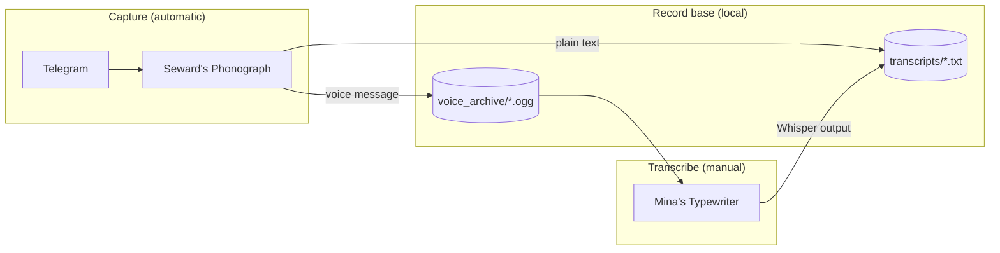

# Harker's Archive

<p align="center">
  
</p>

*In Dracula, Seward dictated his diary into a phonograph; Mina typed the transcripts.*

**Harker's Archive** is a personal record base built from voice and text notes — the same flow, rebuilt for Telegram and Whisper. Capture on your phone, archive locally, transcribe when you are ready.

| Module | Role | Docs |
|--------|------|------|
| [**Dr. Seward's Phonograph**](sewards_phonograph/) | Telegram bot — saves voice (`.ogg`) and typed text (`.txt`) | [README →](sewards_phonograph/README.md) |
| [**Mina's Typewriter**](mina_typewriter/) | Whisper batch transcription — CLI + Streamlit | [README →](mina_typewriter/README.md) |

## How it works



| Step | Tool | When |
|------|------|------|
| Capture voice | Seward's Phonograph | Automatic while the bot runs |
| Capture text | Seward's Phonograph | Automatic while the bot runs |
| Transcribe voice | Mina's Typewriter | Manual — run CLI or Streamlit when ready |

Typed notes land in `transcripts/` immediately. Voice files wait in `voice_archive/` until you run Mina's Typewriter.

## Record base layout

```text
harkers_archive/
├── voice_archive/       # raw audio (.ogg from Telegram) — gitignored
├── transcripts/         # typed notes + Whisper .txt output — gitignored
├── sewards_phonograph/  # Telegram capture bot
├── mina_typewriter/     # Whisper transcription
├── .env                 # shared config (gitignored; copy from .env.example)
└── uv.lock              # shared workspace lockfile
```

**Filename conventions**

| Source | Pattern | Example |
|--------|---------|---------|
| Voice message | `{YYYYMMDD}_{HHMMSS}_{user_id}.ogg` | `20260524_151230_123456789.ogg` |
| Typed note (daily file) | `typed_notes_{YYYYMMDD}_{user_id}.txt` | `typed_notes_20260524_123456789.txt` |
| Whisper transcript | `{basename}.txt` + `{basename}_segments.txt` | `20260524_151230_123456789.txt` |

Each typed note is appended with a timestamp: `[20260524_151230] Your message here.`

## Prerequisites

| Requirement | Used by |
|-------------|---------|
| **Python 3.13+** | All modules |
| **[uv](https://docs.astral.sh/uv/)** | Dependency management |
| **ffmpeg** (`brew install ffmpeg`) | Mina's Typewriter |
| **Telegram bot token** ([@BotFather](https://t.me/BotFather)) | Seward's Phonograph |

## Tutorial

End-to-end workflow from zero to archived notes.

### 1. Install dependencies

From the repo root:

```bash
uv sync --all-packages
```

### 2. Create a Telegram bot

1. Open [@BotFather](https://t.me/BotFather) in Telegram.
2. Send `/newbot`, follow the prompts, and copy the bot token.

### 3. Configure environment

```bash
cp .env.example .env
```

Edit `.env` at the **repo root** with **absolute** paths:

```bash
TELEGRAM_BOT_TOKEN=your-token-from-botfather
SAVE_DIR=/absolute/path/to/harkers_archive/voice_archive
# Optional; defaults to sibling transcripts/ next to SAVE_DIR
# TRANSCRIPTS_DIR=/absolute/path/to/harkers_archive/transcripts
```

Both sub-projects load this file automatically. See [Configuration](#configuration) for all variables.

### 4. Capture notes (phonograph)

```bash
cd sewards_phonograph
uv run python bot.py
```

Keep the process running. In Telegram, open **your** bot and:

- Send a **voice message** → saved to `voice_archive/`
- Send **plain text** → appended to `transcripts/typed_notes_YYYYMMDD_<user_id>.txt`

The bot replies with the saved filename. Use `/start` or `/help` for a reminder.

To run in the background: `nohup uv run python bot.py >> bot.log 2>&1 &` — see [sewards_phonograph/README.md](sewards_phonograph/README.md) for details.

### 5. Transcribe voice (typewriter)

Transcription is **manual** — run when you are ready:

```bash
cd mina_typewriter
uv run python transcribe.py
```

The CLI reads `voice_archive/` and writes to `transcripts/` by default. Override with `HARKERS_INPUT_DIR` and `HARKERS_OUTPUT_DIR` in the root `.env` if needed.

Or use the Streamlit app to pick custom folders:

```bash
uv run streamlit run app.py
```

Each voice file produces `<basename>.txt` and `<basename>_segments.txt`. The first run downloads Whisper model weights — see [mina_typewriter/README.md](mina_typewriter/README.md) for model choices and tuning.

## Configuration

All settings live in the root `.env`. Sub-projects resolve it automatically.

| Variable | Module | Required | Description |
|----------|--------|----------|-------------|
| `TELEGRAM_BOT_TOKEN` | Phonograph | Yes | Bot token from BotFather |
| `SAVE_DIR` | Phonograph | Yes | Absolute path for voice `.ogg` files (e.g. `…/voice_archive`) |
| `TRANSCRIPTS_DIR` | Phonograph | No | Absolute path for typed notes; defaults to sibling `transcripts/` next to `SAVE_DIR` |
| `HARKERS_INPUT_DIR` | Typewriter | No | Override input folder; defaults to `voice_archive/` |
| `HARKERS_OUTPUT_DIR` | Typewriter | No | Override output folder; defaults to `transcripts/` |

## Going deeper

Each module has its own README with artwork, troubleshooting, and reference docs:

- **[Dr. Seward's Phonograph](sewards_phonograph/README.md)** — commands, filename rules, background running, manual test plan
- **[Mina's Typewriter](mina_typewriter/README.md)** — Whisper models, transcription options, Streamlit UI, CPU/GPU notes

## Adding modules

Add a new top-level folder with its own `pyproject.toml`, then register it under `[tool.uv.workspace] members` in the root `pyproject.toml`. Shared data stays in `voice_archive/` and `transcripts/`.

## License

Add a license here if you publish or share this repo.
